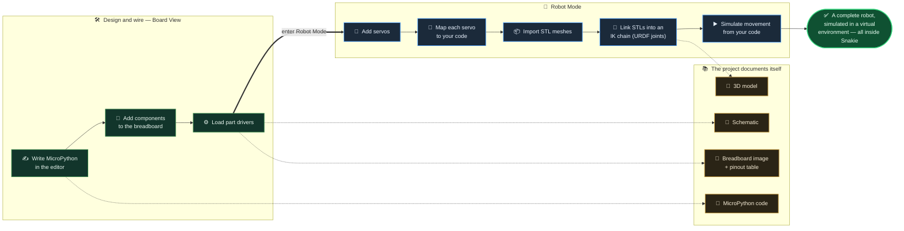

<!--
  Snakie — "Robot Mode" homepage section (work in progress / nearly ready).
  Drop this straight into the kevsrobots.com Snakie page.
  The fenced ```mermaid block renders natively wherever Mermaid is enabled
  (Jekyll + mermaid.js, GitHub, most static-site setups). If your site doesn't
  render Mermaid, use the self-contained snakie-robot-workflow.html preview instead.
-->

## Simulate a whole robot — without the robot

**Coming soon to Snakie.** Design the circuit, write the code, print the parts,
then watch your MicroPython *drive a 3D model of the robot* — all in one app,
before a single wire is soldered.

Snakie already parses your code to draw your board and run live instruments.
**Robot Mode** takes it the whole way: add servos, import your printed STLs, link
them into a kinematic chain, and press play. The model moves exactly as your code
tells the real servos to — a full virtual test bench on your desktop.

And because everything lives in one project folder, the project **documents
itself**: a schematic, a breadboard wiring image with a pinout table, the code,
and the 3D model all stay in sync.



> **Where it stands:** Robot Mode is a work in progress and nearly ready to
> share — the Board View, wiring/pinout docs and live instruments ship today;
> the STL import, IK chain and code-driven simulation are landing next.
